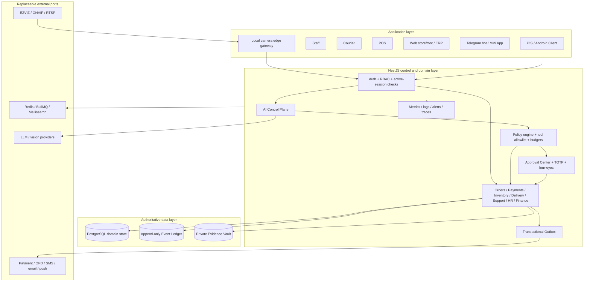

# AliStore AI Executive OS — Target Architecture

Status: Phase 0 contract, not proof of production activation.
Source of truth: PostgreSQL domain state + append-only Event Ledger.

## Principles

1. Clients request commands; they never assert identity, role, price, stock,
   approval, payment or delivery truth.
2. Domain services own mutations. AI may observe, analyze, recommend and draft;
   it cannot write business tables directly.
3. Every money/stock/status/role/legal-message mutation is authenticated,
   authorized, idempotent, validated by policy, audited and approval-gated when
   required.
4. External systems are ports, never sources of business truth. Redis,
   Meilisearch, object storage, Telegram and camera gateways degrade explicitly.
5. Face recognition is out of scope until a separate legal/privacy decision.

## System layers



## Domain boundaries

| Boundary | Owns | Must not own |
|---|---|---|
| Auth/RBAC | customer/staff identity, sessions, active state, role authorization | business approval or pricing |
| Orders | cart-to-order snapshots, order state machine, fulfillment orchestration | provider settlement truth |
| Payments/Finance | intents, payments, refunds, reconciliation, accounting entries | client-calculated amount |
| Inventory | IMEI/quantity lifecycle, reservations, valuation, movements | AI-generated stock mutations |
| Delivery | assignment, delivery state, evidence, COD handover | customer-supplied courier identity |
| Support/CRM | tickets, SLA, transitions, consent-safe notifications | autonomous customer-facing AI send |
| Approval Center | parked request, approver policy, TOTP, four-eyes, executor dispatch | domain rules duplicated in UI/AI |
| Event Ledger | immutable facts about committed mutations | operational queue or mutable projection |
| Evidence Vault | private objects, signed access, access log and retention | public static files or indefinite camera clips |

## AI levels L0–L5

| Level | Capability | Default authority | Required controls |
|---|---|---|---|
| L0 | Observation | Read scoped facts | RBAC, minimization, audit read trace |
| L1 | Analytics | Calculate/source-backed explanation | deterministic metric contract, provenance |
| L2 | Recommendation | Suggest next action | typed output, confidence policy, no mutation |
| L3 | Draft | Prepare response/task/document | human review; no send/publish |
| L4 | Approved action | Request a domain command after approval | policy, RBAC, TOTP/four-eyes, idempotency, ledger |
| L5 | Bounded automation | Execute only pre-authorized low-risk command | explicit limit, service identity, budget, kill switch, rollback |

L5 is denied for payments, refunds, price, stock, roles, salaries, legal messages,
deletion and publication. Those remain L4 at most.

## AI Executive response contract

Every Executive result must validate against this logical schema:

```json
{
  "summary": "string",
  "facts": [{ "statement": "string", "source_ref": "string", "observed_at": "ISO-8601" }],
  "recommendations": [{ "action": "string", "rationale": "string" }],
  "confidence": 0.0,
  "risk_level": "low|medium|high|critical",
  "expected_impact": { "metric": "string", "direction": "up|down|neutral", "range": "string" },
  "required_approval": true,
  "owner": "role-or-user-reference",
  "evidence": ["ledger-or-domain-reference"],
  "rollback": "string"
}
```

Rules:

- `facts` without verifiable `source_ref` are rejected.
- `confidence` is omitted or derived from a declared method; never hard-coded.
- `recommendations` are not actions. Execution returns a separate domain command
  ID and corresponding ledger event.
- Prompt text never becomes SQL, URL, tool name or approval payload without
  schema validation and allowlisting.

## AI Control Plane

The existing durable `AiRun → AiRunStep → AiDecision` contour is the single
entry point for ERP, Telegram and future agents. It must own:

- actor/surface context and live RBAC recheck;
- allowlisted tool registry and per-tool input/output schema;
- rate, token, cost and result-size budgets;
- prompt-injection isolation and external URL policy;
- evidence/provenance collection;
- kill switches by global, tool, store and actor scope;
- eval version/model/prompt trace;
- approval request creation, never direct domain writes.

Current gap: Telegram has a parallel AI registry. P2 consolidates it behind the
same control-plane contract while retaining Telegram pairing/revocation fences.

## Event Ledger

All meaningful domain mutations and AI/camera control decisions append an event
inside the same PostgreSQL transaction. Required envelope:

- `id`, `type`, `actor`, `ts`, `payload`, `refs`;
- stable idempotency key on the owning command/entity;
- PII-minimized payload; secrets and raw prompts are prohibited;
- projections may be rebuilt from domain state + ledger facts.

Current gap: append-only is a convention. P0 must add a runtime DB role/trigger
policy that rejects `UPDATE` and `DELETE` on `AuditEvent`, while tests use a
separate privileged cleanup role.

## Approval Center

Approval is a state machine, not a Boolean:

`requested → claimed → approved|rejected|expired|cancelled`.

This is the target state machine. Current Prisma `ApprovalStatus` supports only
`requested|approved|rejected` and has no claim, expiry or cancellation fields.
P0 must add the backward-compatible schema/service/API transition model plus
concurrent-claim, expiry, cancellation and replay tests before this contract is
treated as active.

The server derives requester/approver identity from active tokens. Approval
stores a canonical payload fingerprint, source reference and idempotency key.
Four-eyes actions reject self-approval. The executor calls the owning domain
service within an audited transaction. Approval of an AI draft only approves the
draft; sending/publishing is a distinct domain command.

## Telegram

- webhook secret and replay/idempotency guard;
- private-chat enforcement;
- one-time TOTP-gated staff pairing;
- customer self-scope and live staff-role recheck;
- shared AI Control Plane for reads/drafts;
- all writes through Approval Center;
- explicit data-processor disclosure, minimization and 30-day-or-shorter message retention;
- immediate unlink/revocation fence before enqueue and before send.

## Camera gateway

Raw streams stay on a local edge process. ERP receives only typed, minimal events:

- `queue_length_estimated`;
- `shelf_empty_detected`;
- `camera_offline` / `camera_tamper_detected`;
- `restricted_area_motion`;
- `fall_or_safety_incident`.

Required path:

`EZVIZ/ONVIF/RTSP → local decoder/model → typed privacy filter → signed event → API → review task`.

No raw video/audio enters PostgreSQL. Any evidence clip requires a private object,
purpose binding, signed access, access ledger and TTL no longer than the detection.
Privacy label and TTL are server-derived. Kill switches exist globally, per store,
device, event type and model version. High confidence still creates a review task;
it never changes stock or staff status automatically.

## Observability

Minimum production signals:

- API request/5xx/latency metrics with normalized routes;
- queue depth, oldest age, retries, dead letters and worker heartbeats;
- AI latency, model/tool failure, cost, blocked-tool and approval conversion;
- camera device freshness, rejected payloads, clock skew and purge lag;
- auth failure/lockout/refresh-reuse and privileged action alerts;
- payment/refund/COD/fiscal reconciliation invariants;
- alert delivery test and PII/log redaction test.

All components expose readiness separately from liveness. External-provider
failure degrades the affected feature and never corrupts PostgreSQL truth.

## Data retention

| Data class | Default | Required action |
|---|---|---|
| Event Ledger business facts | statutory/business policy | immutable, PII-minimized |
| AI run metadata | 30–90 days by policy | redact prompt/PII; retain evidence IDs and model version |
| Telegram message text | ≤30 days | purge text/outbox copies; keep minimal audit tombstone |
| Camera event metadata | ≤30 days, shorter where possible | purge payload/evidence link; keep non-identifying tombstone |
| Camera raw video/audio | prohibited by default | separate legal approval and private TTL store only |
| Trade-in/passport Evidence | legal retention matrix | encrypted private object, access audit, subject export/delete rule |
| Auth secrets/tokens | minimum operational TTL | hash/encrypt, rotate, revoke; never log |

No retention is activated merely because storage is available. Legal basis,
purpose, owner and purge verification are mandatory.

## Rollout and rollback

1. Add feature flag and kill switch before enabling a new agent/tool/channel.
2. Deploy schema backward-compatibly; run migration rehearsal and restore drill.
3. Run shadow/read-only mode; compare results against domain facts.
4. Enable for one store/role with budgets and alerting.
5. Promote only after acceptance metrics and failure tests pass twice on one SHA.

Rollback disables the feature/tool/channel, stops workers, preserves queued
commands and ledger facts, and deploys the previous compatible image. Never
rollback by deleting audit history or reversing money/stock facts; use explicit
compensating domain commands.
